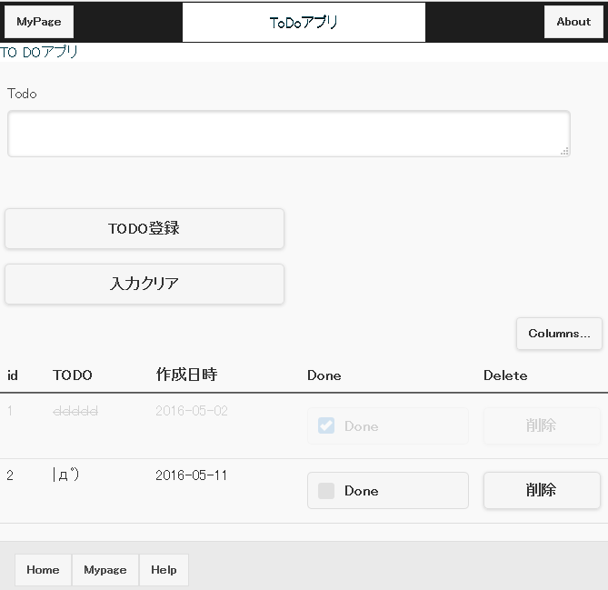

# TODOアプリ
利用技術

    - CakePHP
    - jQueryMobile

## 導入方法

	$ git clone https://github.com/ferretdayo/ToDo_App.git

	$ cd ToDo_App
    
### DBの設定

まず初めに、todo_lists.sqlをMySQLにインポートしてください。

	$ cp app/Config/database.php.default app/Config/database.php


その後、database.phpの中身を


```php
	class DATABASE_CONFIG {
		public $default = array(
			'datasource' => 'Database/Mysql',
			'persistent' => false,
			'host' => 'localhost',
			'login' => 'root',
			'password' => 'password',
			'database' => 'todo_app',
			'prefix' => '',
			'encoding' => 'utf8',
		);
		public $test = array(
			'datasource' => 'Database/Mysql',
			'persistent' => false,
			'host' => 'localhost',
			'login' => 'root',
			'password' => 'password',
			'database' => 'todo_app',
			'prefix' => '',
			'encoding' => 'utf8',
		);
	}
```
としてください。loginとpasswordはそれぞれの環境に合わせてください。

## 実行結果

TODOアプリ画面
